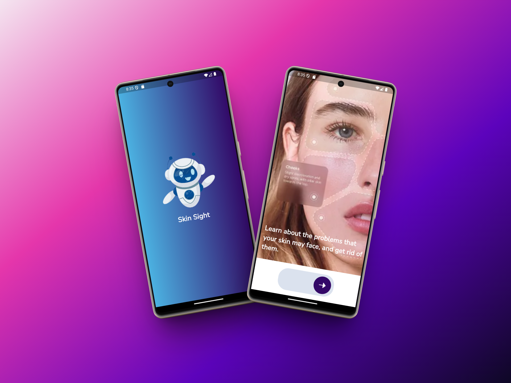
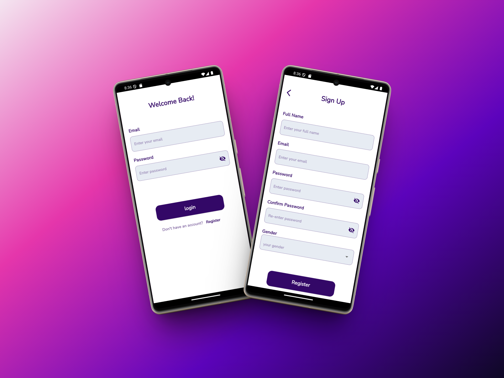
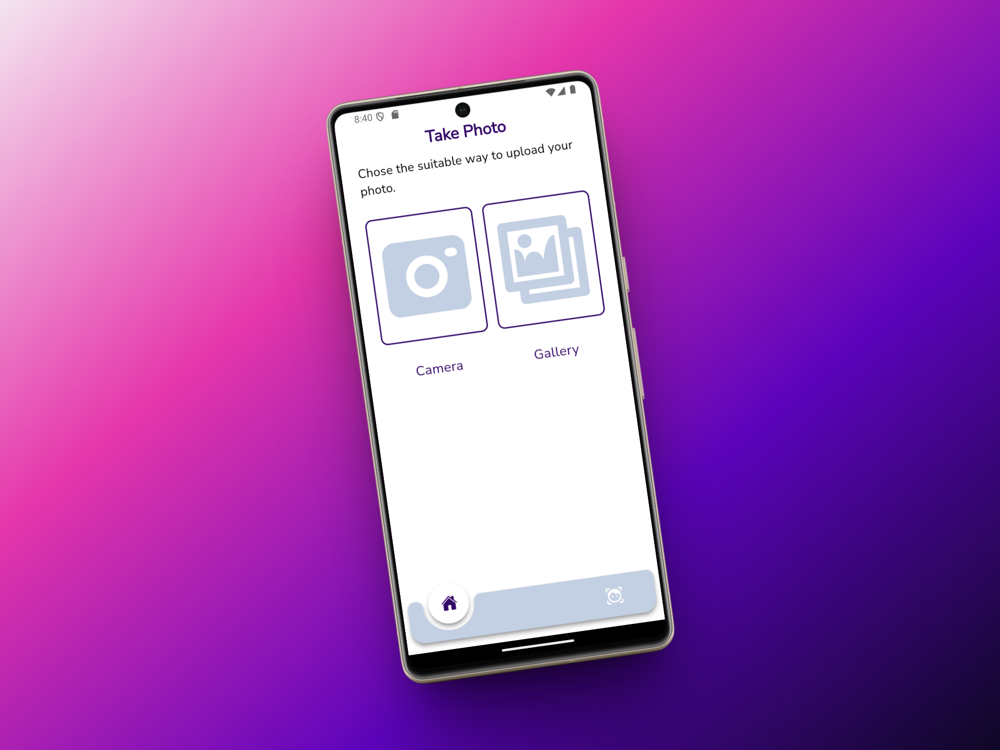
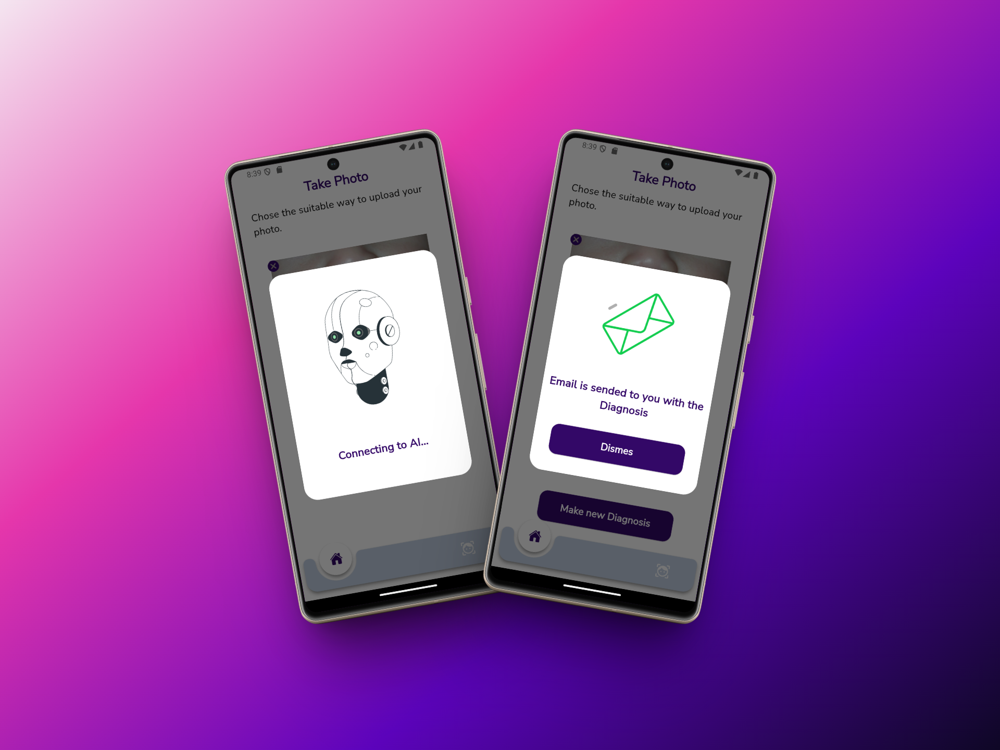
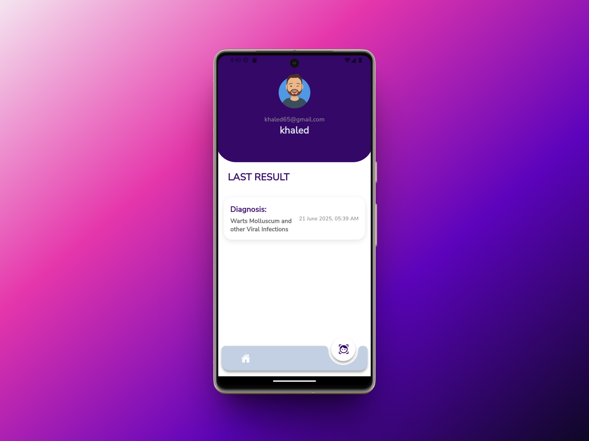

# Skin Sight AI App 


## Description
**Skin Sight AI** is fully functional flutter application powered by AI for diagnosing skin conditions. The app allows users to take a photo of their skin condition and receive an AI-generated diagnosis. It also includes a user-friendly interface for managing personal health records and tracking patient history.

## Features
- Sign up using username, email, password, and gender.
- Sign in with email and password.
- Take a photo of a skin condition and receive an AI-generated diagnosis.
- View patient history and manage personal health records.

## Tech Stack
- Flutter
- Dart
- RESTful API
- AI Model for Diagnosis

## Table of Contents
1. [Installation](#installation)
2. [Usage](#usage)
3. [Images](#images)
4. [Video Demo](#video-demo)
5. [Contributing](#contributing)

   
## Installation 
1. Clone the repository:
   
    ```sh
    git clone https://github.com/KhaledElalfy1/Skin-Sight-AI.git
    ```

2. Navigate to the app directory:
    ```sh
    cd Skin-Sight-AI
    ```

3. Clean the project and install dependencies:
    ```sh
    flutter clean
    flutter pub get
    ```

    ## Usage
     To run the project, use the following command:
     ```sh
       flutter run
     ```


## Images

### Splash screen and Onboarding

  
<p align="center"><i>Welcoming screens guiding the user through app features.</i></p>

### Authentication

<p align="center"><i>Sin in and Sign up screens for user info collection</i></p>

### Home screen

<p align="center"><i>Home screen with options to take a photo or view patient history.</i></p>


### Home screen loading and success state

<p align="center"><i>Loading state while processing the image and success state with diagnosis results.</i></p>

### Patient history and profile

<p align="center"><i>Profile screen displaying user information and patient history.</i></p>


## Video Demo

https://github.com/user-attachments/assets/f629e1a9-ee3f-4b96-8608-3a72d3091754


## Contributing
This project was built by a dedicated team of three developers:

- **Khaled Elalfy** – Flutter Developer – [@KhaledElalfy1](https://github.com/KhaledElalfy1)

- **Khaled Gamal** – Flutter Developer – [@khaledgamal22](https://github.com/khaledgamal22)

- **Dina Ahmed** – Flutter Developer – [@Dina266](https://github.com/Dina266)